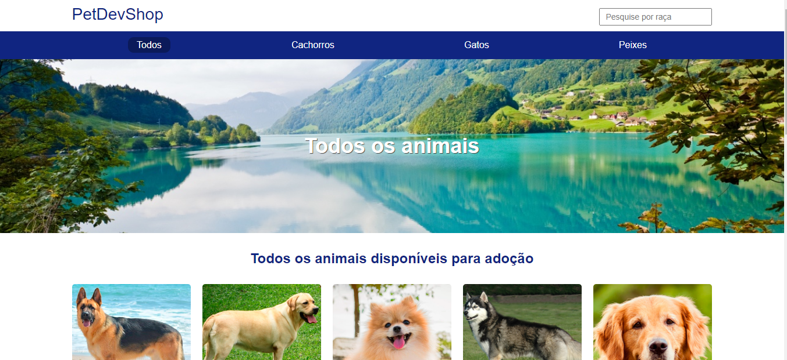
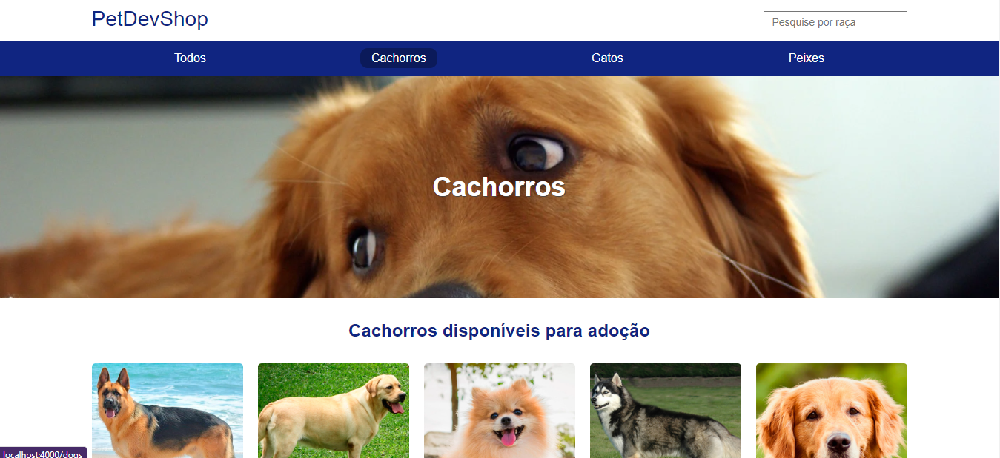
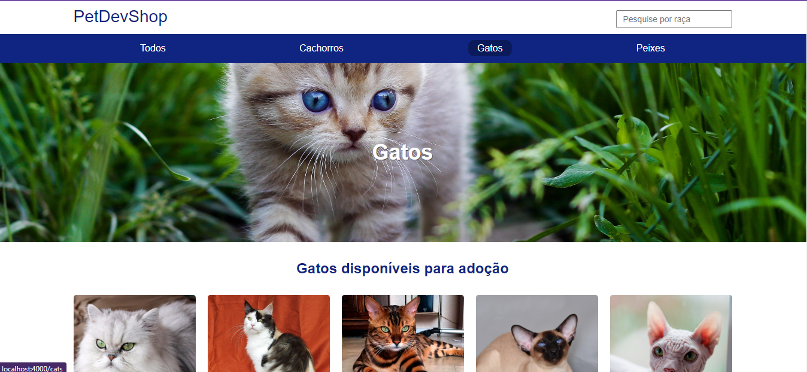
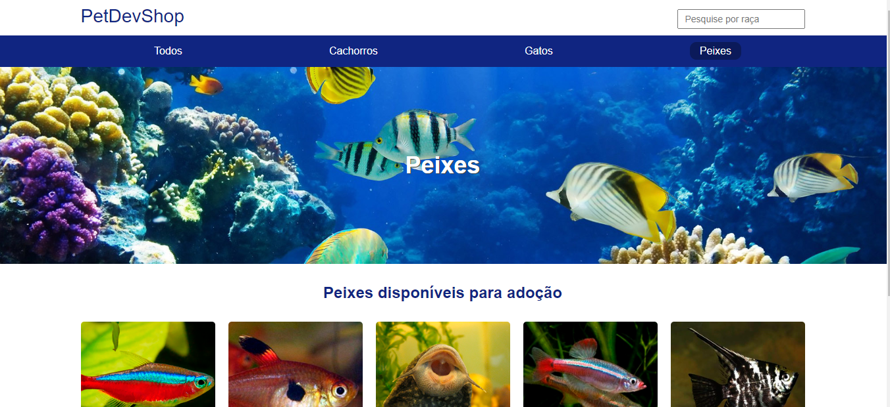

# nodets-canil
Projeto criado com node e typescript e mustache no front-end

### Pré-requisitos globais:
`npm i -g nodemon typescript ts-node`

### instalação
`npm install`

### Para rodar o projeto
`npm start-dev`

### Imagens do site

